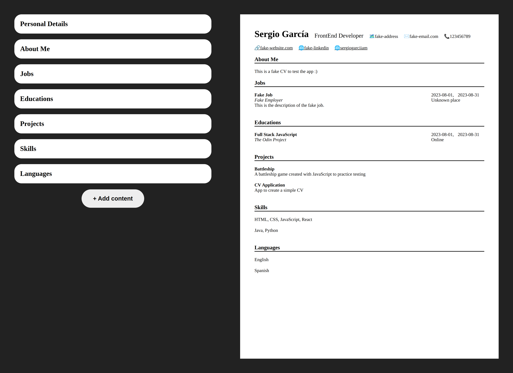

# CV Application

App to create a simple CV

## About the App

This project is from [The Odin Project](https://www.theodinproject.com/lessons/node-path-react-new-cv-application) curriculum.

### Features

- The following sections can be added: personal details, about me, roles, educations, projects, skills, languages
- Have local storage
- It's support responsive design (only the creation)

### Tools and technology

- Visual Studio Code
- Linux Terminal
- Figma
- Git and GitHub
- HTML and CSS
- JavaScript
- React
- Vite

### Learnings

- Setting up a react environment using vite

- Basic use of react

## Screenshot

## Acknowledgements

- Project idea by [The Odin Project](https://www.theodinproject.com/)
- Web icon from [favicon](https://favicon.io/)

## Author

[Sergio García](https://github.com/sergiogarciiam)

## License

This project is open source and available under the [MIT License](./LICENSE).
